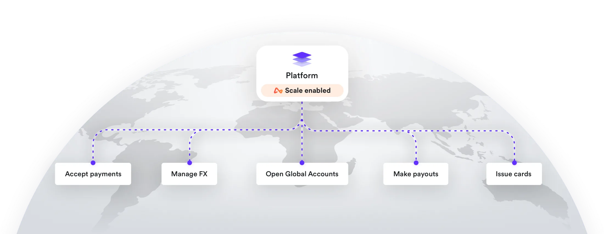

# Case Study on Fintech Company **AIRWALLEX**

# Overview and Origin

## <u>About</u>

Airwallex is a Melbourne, Australia based global payments fintech transforming the way businesses move and manage money domestically and internationally.

With technology at the core, they built a proprietary global financial infrastructure platform to help businesses transact, collect and pay in any foreign currency across 130+ countries and 50+ currencies, without the constraints of the traditional global financial system.

In just five years since foundation, Airwallex has grown to become Australia’s fastest-growing fintech unicorn (US$ 1 Billion Valuation) and a well-funded international technology leader backed by world-leading investors.

Airwallex has  been recognised and awarded by leading independent authorities, such as listing in Forbes' Cloud 100 2020, and placing in the Top 50 of KPMG’s Global Fintech100 two years in a row.

## <u>Incorporation</u>

The company was incorporated on the 3rd December 2015
It's registration details are:

* Registered as: ***Airwallex Pty Ltd***
* ABN : ***609 653 312***
* ACN : ***37 609 653 312***
* Address: *Level 7, 15 William Street, Melbourne*
  
## <u>Founders</u>

> 
> from left: Xijing Dai, Lucy Liu, Jack Zhang and Max Li.

 

## <u>Idea and Foundations</u>

Founders Jack Zhang and Max Li were looking for a side-hustle to supplement their day jobs and opened a coffee shop; ***Tukk & Co***. For this, they ordered take away coffee cups and labels from China to reduce costs.

The process, timeliness, high exchange rates and exorbitant fees was 'painful' They soon realised that it was the same for other small business owners.

 > "We had ordered a big batch of takeaway cups from China because importing them was much cheaper than buying locally, but when it came time to pay the invoice I was shocked at how badly we were getting fleeced on the foreign exchange rate and fees" Mr Zhang

They, thus, set up AirWallex to provide small businesses needing to make cross-border payments with a cheaper alternative to the banks or the likes of Western Union and Paypal.

### <u> Today </u>

* 10 International Offices
* 420+ Staff
* 130+ Payable Countries 
  
## <u> Funding </u>

### <u> Investors  </u>

 

> 

# Business Activities

### <u> ***Financial Problem*** </u>

International payments have high fees and transaction costs, especially for small and medium enterprises, as they do not have the bulk to receive discounts.

They also need to work with local banks to convert the currencies and  manage forex rates  which fluctuate minute to minute.

The process also takes many days to complete

The transfer process is managed through correspondent banking network (supported by the SWIFT messaging protocol and largely unchanged since the 1970s).

In practice, businesses that use this service are subjected to high-fees, slow-processing times, minimum transaction sizes and volume limitations.
There is also breadth and depth of compliance screening in terms of  KYC (Know Your Customer), AML (Anti-Money Laundering) and CTF (Counter-Terrorism Financing).

The process is so complex that only a few banks are able to maintain the relationships and compliance that international transfer through correspondent banking requirements.

This means that huge profits pool between a few players, resulting in limited internal pressure to change the system for the customer’s benefit.

Australian regulators estimate customers could have saved $150 million in fees in 2018 if they had used less costly services than those provided by the four largest banks: National Australia Bank (NAB) Commonwealth Bank (CommBank), Australia and New Zealand Banking Group (ANZ) and Westpac (WBC).

###  <u> AirWallex Solution</u>

The AirWallex proprietary platform allows users to set up overseas bank accounts for businesses in other countries. This allows customers to pay in their local currency and using their preferred channel like mobile money, local transfers and country specific payment methods like WeChat.

With machine learning and data transparency practices they providing the customers with interbank forex rates, forex rate lock in and best payment route.

This can reduce costs for businesses by as much as 90% based on traditional foreign exchange rates, resulting in fees of less than 1%.

The company also provides APIs to this platform allowing companies to build payment ecosystems and also integrate payment and receivables into automated processes and accounting systems.

Recently AirWallex started issuing virtual cards in partnership with Visa and has launched a loyalty programme.

###  <u> Customers</u>

The primary customer base for AirWallex are Ecommerce companies that sell globally. AirWallex allows them to receive payments in local currencies.
By using their local bank account, their customers can participate in local marketplaces like Amazon, EBAY, Catch which require a local bank account.

They are also targeting service companies, travel companies and agencies. With their virtual card & wallet offerings, these companies can issue virtual cards towards spend management and receipts to global team members

With their API platform, AirWallex is working with technology companies to provide them a single payment and receivables platform. These companies can integrate global payments into their offering or platform. With the platform, they can programmatically open global accounts, issue virtual cards, manage forex, make and receive payments.

####  <u> Addressable Market / Market Analysis </u>

As per the McKinsey Global Payments map, the global payments industry is estimated at approximately **US $ 1.9 trillion** at the end of 2020 (reporting).This takes into account the shrinkage due to COVID 19 Crisis.

Selling on digital global marketplaces is driving up merchants’ payments-acceptance costs, which are expected to rise by an incremental $8 billion to $15 billion (about 6 to 10 percent) as commerce migrates to these higher-cost channels.

Just as importantly, merchants also face higher decline and fraud rates on digital transactions, with ramifications for customer experience.

AirWallex's major business is from and to China.
 **[China's cross-border payments]** rose 30.6% in 2019 to RMB 34 trillion (US$4.8 trillion), according to the People's Bank of China. Cross-border payments are rising in tandem with cross-border e-commerce. From 2015-2018 China's cross-border e-commerce grew at a compound annual rate of 76%, according to a report published in late 2019 by consultancy Deloitte, the China International Chamber of Commerce and Alibaba's AliResearch.

[China's cross-border payments]: https://www.kapronasia.com/asia-payments-research-category/how-did-airwallex-manage-to-raise-us-160-million-during-the-covid-19-pandemic.html

> "Merchants are willing to
accept higher fees for demonstrated value, such
as improved authorization rates, a more seamless
payments experience, or improved cart conversion
through point-of-sale financing." McKinsey

> "Australian consumers purchase the equivalent of over AUD40 billion in foreign currency each year and further competition in the supply of FX services has the potential to deliver significant savings for consumers in relation to those purchases, both in aggregate and for individual consumers" ACCC

####  <u> Technologies </u>

Airwallex technology details are ***not*** publicly published. Looking at the blogs, job postings and YouTube videos, the following are assumed:

1. User Interfaces:
   * HTML
   * CSS
   * Javascript (React)
   * Mobile - Android and IOS
2. API and Microservices:
   * Business Logic - Java and Kotlin with Spring Framework
   * API gateway - Apache Apisix
   * Event and Message Management - Kafka
3. Databases:
   * Redis
   * Postgres
   * Hazelcast
4. Google Cloud Platform
5. Container Technology:
   * Docker
   * Kubernetes
6. Other:
   * Python
   * Tableau 
   * Datalogic 
   * Prometheus
  
> "Our technology takes location, time, and available payment routes into consideration as part of the calculation process so as to minimise risk and cost while increasing speed of delivery. This allows us to process thousands of transactions per second as cost-effectively as possible, and deliver payments to over 100 countries globally."

# Landscape

###  <u> B2B Payments Domain </u>

AirWallex's offerings are primarily in the B2B cross-border payments and receivables domain.
This allows their customers to seamlessly receive and pay money in the countries they offer their goods and services.
Having local accounts, a company can offer multiple localised payment options to their customers.

###  <u> Trends and Innovation </u>

* Managing currency risk: Currency exchange rates change on a minute by minute basis. There are also bank holidays and weekends when the markets are not available. The use of machine learning has brought better forecasting capability to enable forex rate locking and improved hedging.

* Forex rates and fees: Availability of forex was very difficult due to volume and fees. Technology companies started offering transparent interbank  rates to customers directly with low fees.
  
* Settlement time: In the past 3-5 years, settlement time i.e. time from when the payment is made to when it is received has substantially decreased. International payments today arrive in one business day. Digitally built networks have assisted here.

* Digital Identity and Onboarding: Proofed digital identity, digital signing and identity exchange standards have allowed organisation to quickly onboard customer and authenticate identities. This has also made digital detection of forgery possible; at scale.

* Digital Payments: The growth of digital payments globally has allowed quicker and convenient recovery of dues and also settlement of payments
  
* Cloud: Cloud technologies have enabled such fintech companies to quickly expand and roll out their services in multiple markets, globally.
  
* API Driven Platforms: The rise of API Driven platforms has allowed Fintech companies to specialise in Financial offering thus improve them. They are then able to use their APIs to engage the larger Financial ecosystem.

###  <u> Domain Players</u>

The top players in this domain are:

1. Paypal
2. Transpay
3. Trasferwise
4. Due
5. WorldRemit
6. Western Union
7. OFX
 
# Results

 ### <u> Business Impact</u>

 Airwallex today has grown to over 130 payable countries and with over 10 international offices. 
 Being a private company, it does not publish revenue and customer numbers.
 They have helped reduce costs for users by as much as 90% based on traditional foreign exchange rates, according to the company, resulting in fees of less than 1%.
 In the past year the company recorded revenue growth of more than 500 per cent and it achieved an annual run rate of $US10 billion in transaction processing volumes.

Despite its sky rocketing value, AirWallex's reported revenues are modest. In the most recent financial records filed with the regulator for the year ending June 30, 2017, Airwallex reported revenue of $14,803 and a loss of $806,195.
Though it is now "tracking well beyond" its forecast of $20 million.

###  <u> Domain Metrics & Performance Relative to Competitors </u>

| **Business Area**  | **KPI** | **Description** |  **Performance** |
| ----------- | ----------- | ----------- | ----------- |
| Business Offering   | Countries & Currencies offered | Number of currencies and countries    |:arrow_up: |
| Business Offering   | Growth in Volume of Money | Daily / Monthly / Annual volume of money handled    |:arrow_up:|
|Business Offering   | Settlement time | Time taken from payment to receipt    |:arrow_up: |
| Business Offering    | Cost of transaction | Cost relative to industry     | :arrow_up:|
| Business Offering  | Onboarding Efficiency | Ease and Time to Onboard Customer    | :arrow_up:|
| Business Offering  | Customer Management | New Customers/ Return Customers / Customer Support / Customer Ratings    |:arrow_up: |
| Company   | Profit Margins | Is the company Profitable    | :arrow_down:|
| Company   | Operating Countries | Growth in global local presence    | :arrow_up:|
| Risk   | Reduce Regulatory Non Compliance | Number of cases of regulatory Non Compliance    | :arrow_down:|
| Platform   | Platform's Performance | Volume and Time taken for transactions    | :arrow_up:|
| Security   | Platform's Security | Security Protocols / Breaches and Standards    | :left_right_arrow: |
|Platform| Integration between various platforms |New integrations enabled through APIs| :arrow_up:|
|Platform|Integration between various Partner|New Partners Onboarded on API Platform| :left_right_arrow: |
|Platform|Adoption for digital use cases|Number of new digital interactions enabled|:arrow_up: |
|Platform|Cost reduction|Cost per transaction through available APIs| :arrow_up:|
|Platform|Innovation|Number of new Industry leading features| :arrow_up: |
|Platform|Time to Market|Speed at which new features are rolled out | :arrow_up:|
|Platform|Data monetisation|Availability and Use of Data Collected| :arrow_up: |
|Platform|Automation|Intelligence and Automation levels of processes in financial payment offered| :left_right_arrow: |
|Platform|Availability|Technology Uptime and Availability| :arrow_up:|

***Key***

| Description | Key |
| ---------------|----|
|Performing Well|:arrow_up:|
|At par with industry|:left_right_arrow:|
|Can do better|:arrow_down:|

# Recommendations

### 1. <u> Product Offering </u>

AirWallex could look at adding the following to their portfolio:

* International credit rating capability to increase trust in the B2B Partner ecosystem
* Payment gateway linked to the customer's account. They have started looking at this.
* Buy now pay later API that their customers can offer purchasers of the goods and services.
* Allow ordinary citizens to manage multi currency accounts; not only businesses.
* Provide local company registration services through their platform to allow SMEs to also set up registered companies

Benefits:

* Increase in partner activity on platform with increased trust due to fewer case of cheating and forgery.
* Payment gateways will further provide the funding directly into customer's account without involving another intermediary
* BNPY capability will allow their customers to sell more and receive the money immediately, while improving payment flexibility for their customers
* Allowing people to manage multiple currencies will increase the platform usage and thus profitability. It will also extend the value of the platform to people remitting money or paying in other countries. This may also increase the industries serviced.
* Customers with local businesses, over a local account, will be able to benefit from local incentives, rules and regulations available to registered companies.

### 2. <u> Technology </u>

Not much is available of the technologies used by the organisation but looking at what is suggestions could be put forward:

* Invest in RegTech platforms or partner with existing RegTech companies to improve the regulatory compliance and catch fraudulent transactions earlier.
* Provide APIs in Industry standards like GraphQL and OpenAPI to enable broader usage and reduce the number of wrong calls.
* Partner and Integrate with Government Identity Platforms so as to offload identity proofing to the regulatory body that ensures that local customer identification are always up to the standards required.
* Move to technologies based on FIDO standards for authentication over OAuth as being driven by larger Fintechs like PayPal.
* Contribute to Opensource and open parts of your technology stack to bring in better contributions.
* Look at trends in blockchain based identity providers to ensure the provenance of documents and digital identities.

## Forward

>> "We started with payments and now we are building a global financial infrastructure, we are the Amazon Web Services (AWS) of global banking.We built a technology layer or API [Application Programming Interface] layer sitting on top of more than 50 banks around the world." Zhang

## Reference Links
* [Airwallex](https://www.airwallex.com/au)
* [ACCC Foreign currency conversion services inquiry ](https://www.accc.gov.au/focus-areas/inquiries-finalised/foreign-currency-conversion-services-inquiry)
* [ACCC Foreign currency conversion services inquiry report](https://www.accc.gov.au/publications/foreign-currency-conversion-services-inquiry-final-report) 
* [Press Coverage](https://www.globenewswire.com/news-release/2020/06/30/2055632/0/en/Global-B2B-Payments-Market-Innovations-in-the-Way-Businesses-Transact-PMI.html)
* [Investment](https://www.pymnts.com/earnings/2019/mastercard-contactless-b2b-cross-border-growth/) 
* [Press Coverage](https://asia.nikkei.com/Spotlight/Startups-in-Asia/Fintech-unicorn-rewrites-forex-rules-to-snag-big-bank-profits)
* [Press Coverage](https://www.cnbc.com/2019/07/30/airwallex-from-coffee-shop-to-australias-fastest-growing-unicorn.html)
* [Press Coverage](https://www.smh.com.au/business/small-business/coffee-cup-dilemma-leads-to-australia-s-latest-1b-tech-unicorn-20190325-p517bv.html) 
* [Press Coverage](https://www.fintechmagazine.com/technology-and-ai-2/rise-fraud-and-smishing-during-coronavirus)
* [Paypal](https://www.Paypal.com)
* [Ofx](https://www.Ofx.com)
* [Transferwire](https://transferwise.com/au)
* [Western Union](https://www.westernunion.com/)
* [Due](https://due.com/)
* [KPMG Australia Fintech](https://home.kpmg/au/en/home/insights/2017/08/australian-fintech-landscape.html)
* [McKinsey Global Payments](https://www.mckinsey.com/~/media/mckinsey/industries/financial%20services/our%20insights/accelerating%20winds%20of%20change%20in%20global%20payments/2020-mckinsey-global-payments-report-vf.pdf)
* [Hong Kong Funds Suspended](https://www.afr.com/technology/airwallex-has-26m-frozen-in-hong-kong-fraud-probe-20191224-p53mow#:~:text=Aussie%20tech%20unicorn%20Airwallex%20says,funds%20over%20suspected%20fraudulent%20transactions)
* [Australian Remittance and Currency Providers Association](https://www.arcpa.org.au/)
